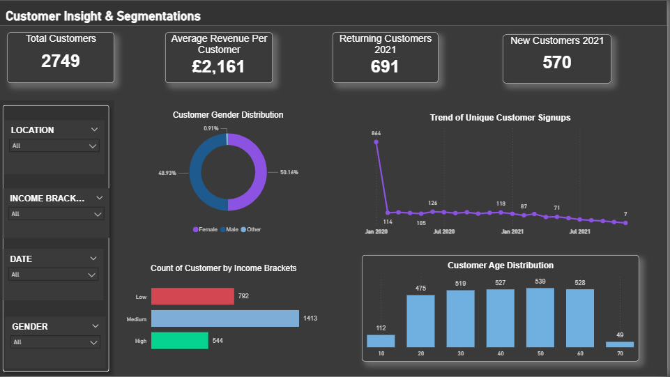
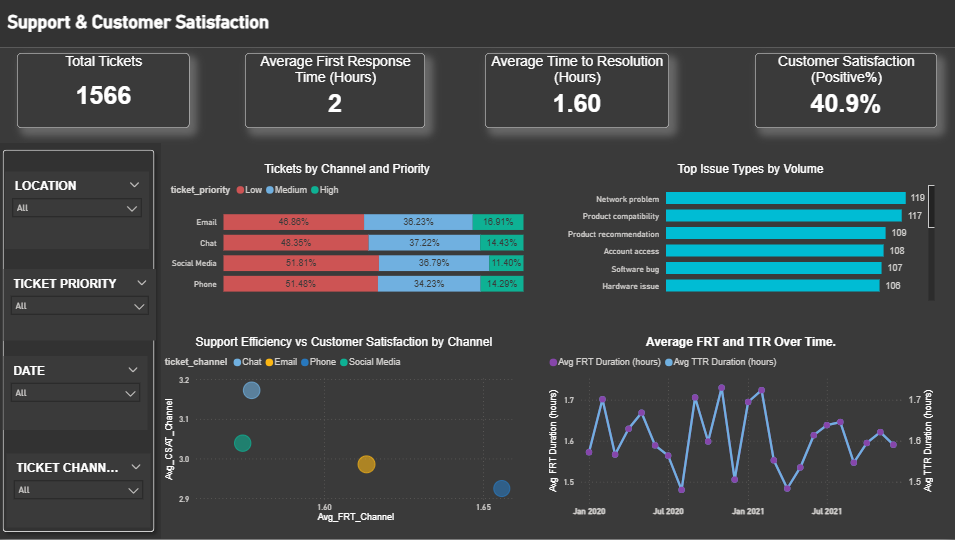

# CRM-Warehouse-Pipeline

Scalable data warehouse pipeline for Power BI dashboards. Primary focus: pipeline architecture, data quality, deployment, and operational monitoring. Secondary: business translation and key insights derived from the Power BI tabs.

## Table of Contents

1. [Project Summary](#project-summary)
2. [Architecture Overview](#architecture-overview)
3. [Component Responsibilities](#component-responsibilities)
4. [Data Model and Layering](#data-model-and-layering)
5. [Operational Patterns and Engineering Practices](#operational-patterns-and-engineering-practices)
6. [Power BI: Tabs and Business Translation](#power-bi-tabs-and-business-translation)
7. [Key Metrics and Findings](#key-metrics-and-findings)
8. [Immediate Priorities](#immediate-priorities)
9. [Data Cautions and Limitations](#data-cautions-and-limitations)
10. [Usage Instructions](#usage-instructions)
11. [Future Work](#future-work)

---

## Project Summary

Deliverable: end-to-end, production-ready CRM data pipeline feeding Power BI. Design goals: reliability, observability, cost efficiency, and modularity. Tech stack used in this repo: Airbyte for ingestion, BigQuery for storage and compute, dbt for transformation and testable models, Power BI for business consumption.

Primary outcome: deployable architecture that supports incremental loads, schema evolution, automated testing, metrics governance, and clear business translation for Revenue and Product performance.

---

## Architecture Overview

```
Data sources (Supabase, transactional feeds, marketing tools)
        |
        v
Airbyte (ingest connectors, incremental replication)
        |
        v
BigQuery raw dataset  - raw ingestion tables (append only)
        |
        v
dbt - staging, transformation, marts, exposures
        |
        v
BigQuery curated datasets  - analytics marts, aggregated metrics
        |
        v
Power BI - semantic layer via curated views and export tables
```

Notes

* All ingests are incremental where supported. Prefers CDC or timestamp-based incremental extraction.
* Datasets separated by environment: `raw`, `staging`, `marts`, `analytics`.
* Materialization strategy in dbt: `ephemeral` for small logic, `table` for heavy aggregates with partitioning, `incremental` for daily builds, `view` for lightweight transformations consumed by Power BI.

---

## Component Responsibilities

Airbyte

* Responsibility: reliable connector-based extraction and replication into BigQuery.
* Config: use normalized schema when feasible. Record CDC and source metadata columns: `_ab_extracted_at`, `_ab_synced_at`, `_source_file_id`.
* Failover: retry policy and self-heal via container restart. Track connector lag metric.

BigQuery

* Responsibility: storage, partitioned compute, and access control.
* Best practices: partition by ingestion date, cluster by high-cardinality join keys such as customer\_id or order\_id, compress and use columnar formats.
* Cost controls: table partitioning, query size limits, scheduled query quotas, authorized views for limiting scanned bytes.

dbt

* Responsibility: transformations, tests, documentation, exposures.
* Structure: `models/staging`, `models/marts`, `models/metrics`.
* Testing: assert uniqueness, not null, accepted range, relationship integrity and incremental freshness tests.
* Documentation: `dbt docs generate` and hosted docs as part of CI/CD.

Power BI

* Responsibility: semantic layer, business translation and visualisation.
* Pattern: use curated aggregated tables from `marts` rather than hitting staging views directly. Keep Power BI model slim and use composite models only when necessary.

---

## Data Model and Layering

Zones

* Raw zone: direct Airbyte output. No transformations. Store source metadata.
* Staging zone: canonical column names, typed columns, minimal joins. Includes dbt `stg_` models per source.
* Marts zone: business entities and grain enforced. Examples: `fct_orders`, `dim_products`, `dim_customers`, `fct_ticketing`.
* Metrics / semantic layer: pre-aggregated tables for Power BI: `mtr_revenue_by_month`, `mtr_customer_segment_summary`, `mtr_support_performance`.

Modeling rules

* Use surrogate integer keys where join performance matters.
* Always enforce timestamp timezone normalization and store UTC.
* Record lineage by exposing `sources` and `exposures` in dbt.

Performance

* Partition daily for event tables. Consider hourly partitions for high throughput.
* Use clustering on `customer_id`, `product_id` and `order_id`.
* Use incremental materializations with `is_incremental()` pattern and merge keys.

---

## Operational Patterns and Engineering Practices

CI/CD

* Git branch policy: feature branches, PRs, main protected.
* GitHub Actions pipeline example:

  1. lint SQL and dbt macros
  2. run dbt deps
  3. run dbt seed and unit tests for changed models
  4. run dbt build for affected models
  5. deploy docs and register exposures
* Deploy strategy: deploy to staging first, run smoke tests, then promote to production.

Testing and Validation

* Unit tests: dbt `schema.yml` tests for uniqueness and referential integrity.
* Data quality: Great Expectations checks or dbt tests for P75 and P95 thresholds, null ratios.
* Regression tests: compare key metrics against previous snapshot and assert within tolerance.

Monitoring and Alerting

* Metrics to monitor: ingestion lag by connector, daily row volume delta, failed job counts, top queries by scanned bytes, SLA for data freshness.
* Alerting: channel alerts for failed Airbyte connector, dbt run failures, BigQuery job errors.
* Observability: export dbt run metadata and BigQuery job logs to a metrics store for dashboards.

Governance and Security

* Use IAM roles in BigQuery: least privilege for service accounts and analysts.
* Use authorized views for consumer access from Power BI to mask PII.
* Catalog metrics and definitions in dbt exposures and README.

Cost Controls

* Schedule heavy transformations in off-peak windows.
* Use query byte limits and row level sampling for exploratory analysis.

---

## Power BI Tabs and Business Translation

Tabs

1. Revenue and Product Performance - primary business translation
2. Customer Insights and Segmentation
3. Support and Customer Satisfaction

Business translation - Revenue and Product Performance

* Goal: identify revenue concentration, SKU risk, AOV drivers, and churn risk signals tied to revenue.
* Actions: prioritize high-value SKU lifecycle, margin protection rules, targeted retention offers for high ARPC cohorts.

## Screenshots

Add Power BI tab screenshots in the `screenshots/` folder and reference them here. Use the following placeholders and captions. Replace file names with your exported `.png` or `.jpg` files.

1. Revenue and Product Performance


2. Customer Insights and Segmentation



3. Support and Customer Satisfaction



---

## Key Metrics and Findings

Revenue

* Total revenue: GBP 5.61M

  * 2019: GBP 1.23M
  * 2020: GBP 2.82M
  * 2021: GBP 1.83M
  * 2022 partial: GBP 63k
* Year on year changes

  * 2019 to 2020: +129.3%
  * 2020 to 2021: -35.1%
  * 2021 to 2022: -96.6% (2022 incomplete and not comparable)
* Implication: revenue concentrated and volatile. Treat 2022 as incomplete window.

Volume

* Units sold: 13,000
* Top products drive revenue concentration. Implication: product level risk exists despite overall volume.

Customer economics

* AOV: GBP 626.80
* ARPC: GBP 2,000
* Implication: high ticket profile. Protect margin and retention.

Ticketing sample

* Customers in sample: 2,749 (support engaged only)
* Income segments: Low 792, Medium 1,413, High 544
* Gender: roughly even
* Implication: medium-income customers are primary support-engaged cohort. Prioritize retention actions on this group.

Support metrics

* Total tickets: 1,566
* Average first response time: 2.0 hours
* Average time to resolution: 1.6 hours
* CSAT positive: 40.9% (sample of tickets with CSAT responses)
* Channel performance

  * Social FRT 1.57h CSAT 3.04
  * Chat FRT 1.58h CSAT 3.17
  * Email FRT 1.61h CSAT 2.99
  * Phone FRT 3.92h CSAT 2.92
* Top issue types: Network 119, Product compatibility 117, Product recommendation 109
* Implication: phone is slow and lowest satisfaction. Email speed acceptable but quality poor. Product and UX fixes will reduce support load.

Statistical hygiene recommendation

* Replace means with medians for skewed distributions.
* Report P75 and P95 for response time and revenue distributions.

---

## Immediate Priorities

1. Fix phone routing and SLA enforcement.
2. Audit email response templates and agent training for quality.
3. Triage product fixes for top issue types to reduce support load and improve CSAT.
4. Replace mean metrics with median and include P75 and P95 bands in dashboards.
5. Implement weekly ops dashboard covering ticket counts, median FRT and TTR, CSAT positive percentage, SLA violators, and revenue at risk.

---

## Data Cautions and Limitations

* Ticketing-derived metrics reflect only customers who submitted tickets. Not representative of full customer base.
* 2022 revenue is partial and not comparable to prior full-year values.
* CSAT sample biased towards customers who provided feedback. Treat absolute CSAT with caution. Use relative changes for decision making.

---

## Usage Instructions

1. Clone the repo.
2. Configure environment variables for Airbyte, GCP credentials, and dbt profiles.
3. Run Airbyte connectors to populate `raw` dataset.
4. Run `dbt deps` then `dbt build --select state:modified` for incremental development.
5. Run dbt tests: `dbt test --select tag:critical`.
6. Export `mtr_` tables to `powerbi/` as CSV or connect Power BI to BigQuery using service account with read access to `analytics` dataset.

Example dbt commands

```
dbt deps
dbt seed --select seeding_file
dbt build --models +marts
dbt test --models +marts
```

---

## Future Work

* Add automated data quality framework such as Great Expectations integrated into CI.
* Build uplift and survival models for retention targeting.
* Implement model explainability for churn and CLTV models.
* Add feature store for shared derived features across models.
* Introduce cost alerts for BigQuery query usage.

---

